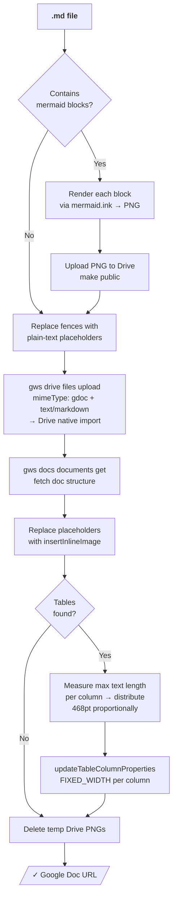
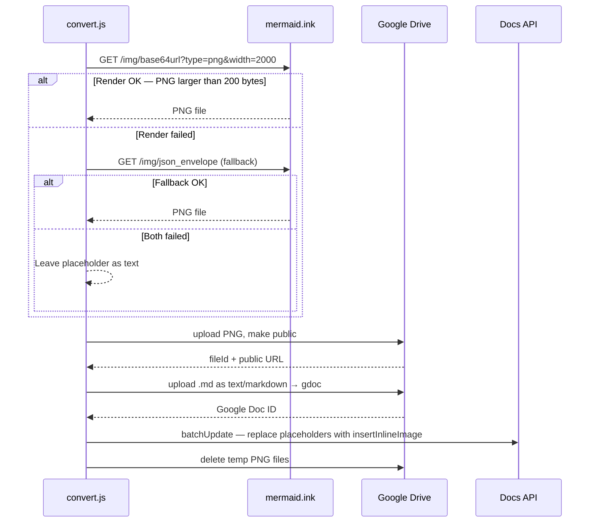

# md-to-gdoc

Convert a Markdown file to a Google Doc — with **mermaid diagrams rendered as images**, **tables auto-sized by content**, headings, bold/italic, code blocks, links, and lists all faithfully preserved.

## How It Works



## Conversion Pipeline — Step by Step

| Step | Mechanism |
|------|-----------|
| **1 — Mermaid pre-process** | Extracts ` ```mermaid ` blocks → renders PNG via `mermaid.ink` → uploads PNG to Drive (public) → replaces fence with a plain-text placeholder |
| **2 — Native upload** | Uploads the `.md` as `text/markdown` with `mimeType: application/vnd.google-apps.document` — Google Drive natively imports it as a Google Doc (real code blocks with syntax highlighting) |
| **3 — Pageless mode** | Optionally sets the doc to pageless layout via `updateDocumentStyle` |
| **4 — Mermaid insertion** | Finds placeholder paragraphs → deletes text → `insertInlineImage` at full page width |
| **5 — Column widths** | Fetches doc structure → measures max text length per column → distributes 468 pt page width proportionally (sqrt-weighted) → `updateTableColumnProperties` with `FIXED_WIDTH` |
| **6 — Cleanup** | Deletes temporary mermaid PNGs from Drive |

## Quick Start

```bash
# 1. Authenticate (one-time)
gws auth login -s drive,docs

# 2. Convert
node skills/md-gdoc/scripts/convert.js path/to/document.md --title "My Doc"
# → https://docs.google.com/document/d/DOC_ID/edit
```

### Options

| Flag | Default | Description |
|------|---------|-------------|
| `--title "My Title"` | filename (no extension) | Google Doc title |
| `--folder-id ID` | My Drive root | Destination Drive folder |
| `--page-width 468` | `468` (US Letter, 1" margins) | Page body width in points for column sizing |
| `--paged` | off (pageless) | Use paginated layout instead of pageless |

## What Gets Preserved

| Markdown | Google Doc |
|----------|-----------|
| `# H1` … `###### H6` | HEADING_1 … HEADING_6 styles |
| `**bold**`, `*italic*`, `***both***` | Bold, italic, bold+italic |
| `` `inline code` `` | Monospace inline |
| ```` ```code block``` ```` | Code block with syntax highlighting |
| `[text](url)` | Hyperlink |
| `` | Inline image (public URLs only) |
| `- item`, `1. item` | Unordered / ordered lists (nested ✓) |
| `> blockquote` | Indented paragraph |
| `\| table \|` | Table with proportional column widths |
| ` ```mermaid ` | Rendered PNG inline image |
| `---` | Horizontal rule |

## Pseudo-Logic: Column Width Algorithm

```javascript
// For each table in the document:
const PAGE_WIDTH_PT = 468;  // US Letter, 1-inch margins
const MIN_PT = 40;

// 1. Measure max text length per column (includes header row)
const maxLens = Array(numCols).fill(1);
for (const row of table.tableRows) {
  row.tableCells.forEach((cell, colIndex) => {
    const len = extractText(cell).length;
    if (len > maxLens[colIndex]) maxLens[colIndex] = len;
  });
}

// 2. Distribute page width proportionally (sqrt-weighted)
const weights = maxLens.map(l => Math.sqrt(l));
const total = weights.reduce((a, b) => a + b, 0);
let widths = weights.map(w =>
  Math.max(MIN_PT, Math.round((w / total) * PAGE_WIDTH_PT))
);

// 3. Scale down if columns overflow page
const sum = widths.reduce((a, b) => a + b, 0);
if (sum > PAGE_WIDTH_PT) {
  const scale = PAGE_WIDTH_PT / sum;
  widths = widths.map(w => Math.max(MIN_PT, Math.round(w * scale)));
}

// 4. Apply via Docs API
widths.forEach((magnitude, columnIndex) => {
  batchUpdate({ updateTableColumnProperties: {
    tableStartLocation: { index: tableStartIndex },
    columnIndices: [columnIndex],
    tableColumnProperties: { widthType: "FIXED_WIDTH", width: { magnitude, unit: "PT" } },
    fields: "width,widthType",   // both required — API returns 400 without widthType
  }});
});
```

## Mermaid Rendering Details



## Gotchas

- **Mermaid needs internet** — mermaid.ink is a public service. On offline/restricted networks, mermaid blocks fall back to plain text placeholders; the rest of the document still converts.
- **Images in the source .md** — only publicly accessible remote URLs are supported; Drive's native import cannot resolve local file paths. Host images externally before conversion.
- **Column widths use character count** as a proxy for visual width — works well for prose-heavy tables. Tables with many short values (e.g., status columns) may need manual fine-tuning in Google Docs.
- **Table optimization is non-fatal** — a failure to set column widths logs a warning but never blocks the upload.

## Dependencies

| Tool | Purpose | Install |
|------|---------|---------|
| `gws` CLI | Google Drive upload + Docs API | [buildwithpi.ai](https://buildwithpi.ai) |
| `curl` | mermaid.ink PNG download | pre-installed on macOS/Linux |
| `node` | Run `convert.js` | [nodejs.org](https://nodejs.org) |

## File Structure

```
skills/md-gdoc/
├── SKILL.md                     ← pi skill definition (auto-loaded by pi)
├── README.md                    ← this file
├── scripts/
│   └── convert.js               ← conversion script (no npm deps)
└── references/
    ├── element-map.md           ← markdown → Docs API mapping + manual request examples
    └── mermaid-guide.md         ← mermaid troubleshooting + alternative renderers
```
